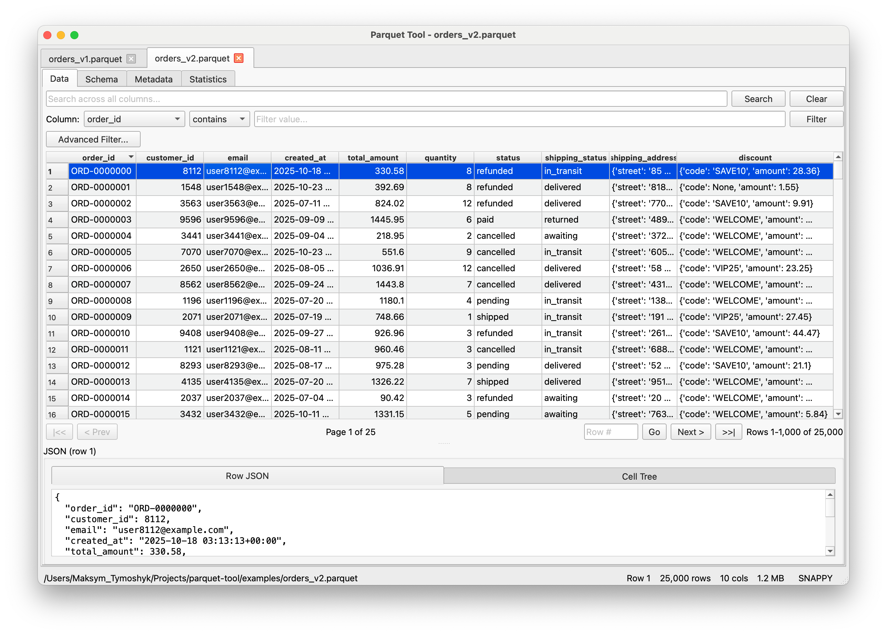
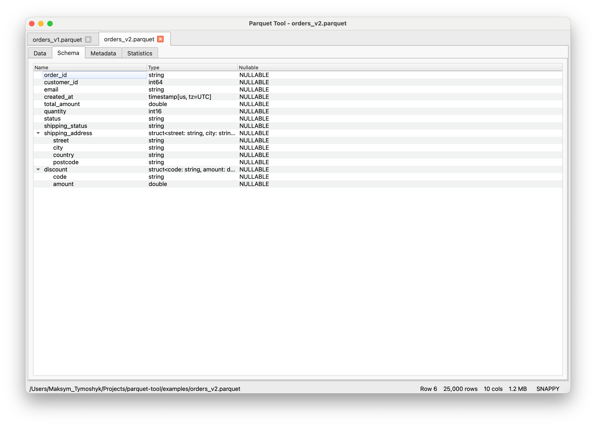
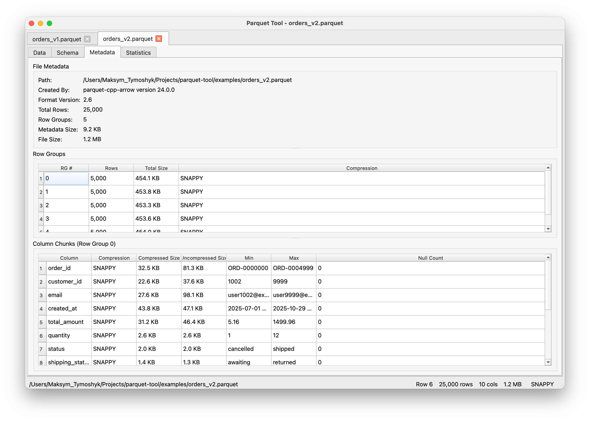
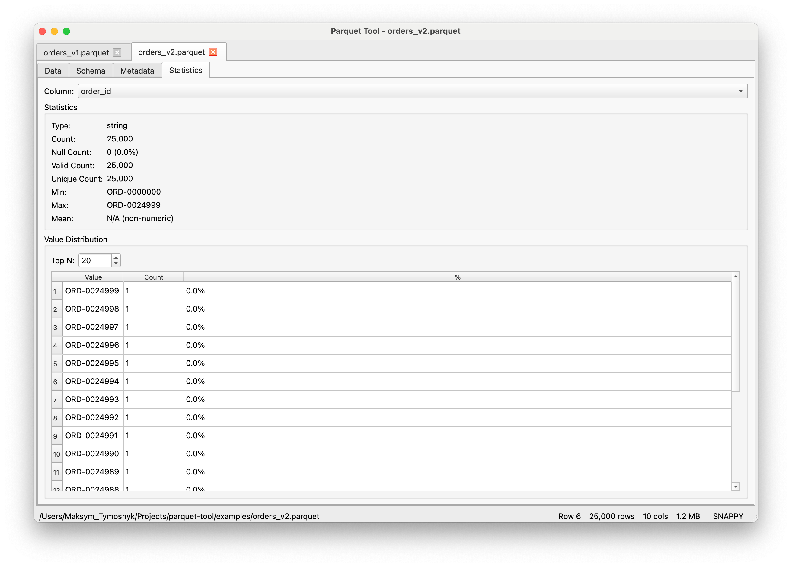
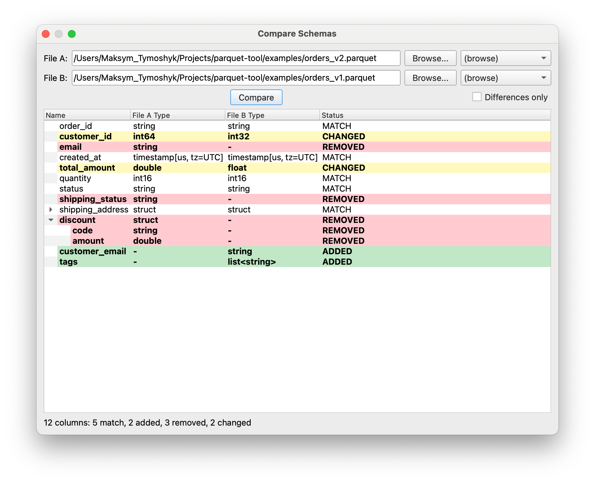
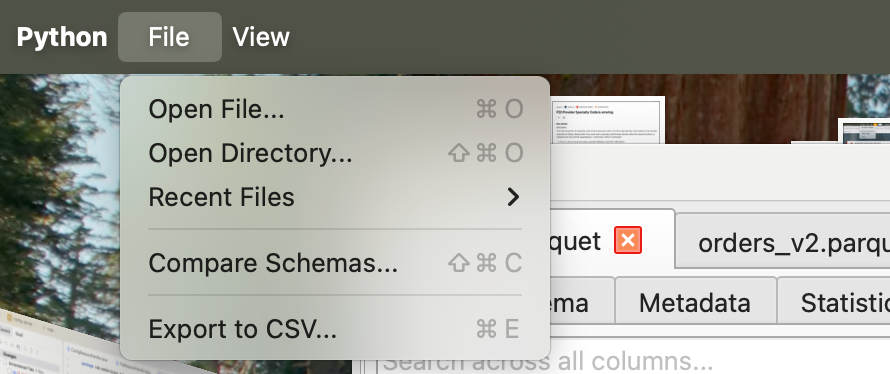

# Parquet Tool

[](https://github.com/maksymtymoshyk/parquet-tool/actions/workflows/tests.yml)
[](https://github.com/maksymtymoshyk/parquet-tool/actions/workflows/lint.yml)
[](https://pypi.org/project/parquet-tool/)
[](https://pypi.org/project/parquet-tool/)
[](LICENSE)

A PyQt6 desktop GUI for inspecting, filtering, and diffing Apache Parquet files. Lazy-loads via the parquet footer + row groups, so it stays fast on multi-GB files without loading everything into memory.

## Features

- **Paginated data viewer** -- 1000 rows/page, sortable columns, handles millions of rows
- **Search & filter** -- full-text search across columns; per-column filters with 8 modes (contains, exact, regex, `>`, `>=`, `<`, `<=`, between); multi-condition AND/OR builder
- **Schema inspector** -- tree view with full nested-type support (struct/list/map)
- **Metadata inspector** -- file metadata, row groups, per-column chunk stats (compression, min/max, null counts, sizes)
- **Column statistics** -- count, nulls, unique, min, max, mean
- **Value distribution** -- top-N most frequent values with percentages
- **Schema diff** -- side-by-side compare two files with color-coded changes
- **CSV export** -- streams row group by row group; honors active filters
- **Nested data viewer** -- double-click struct/list/map cells to drill in
- **Multi-file tabs**, **dark/light theme**, **drag-and-drop**, **persistent settings**, **CLI launch**

## Screenshots

### Data tab

Paginated row viewer with per-column filters, search, and an inline JSON pane for the selected row.



### Schema tab

Nested struct/list/map types expand inline; nullability shown per field.



### Metadata tab

File-level metadata, row group rows, and per-column chunk stats (compression, min/max, null counts, sizes).



### Statistics tab

Per-column stats (count, nulls, uniques, min/max/mean) plus top-N value distribution.



### Schema diff

Side-by-side schema compare with color-coded ADDED / REMOVED / CHANGED rows.



### File menu

Native macOS menu bar with Open / Recent Files / Compare Schemas / Export to CSV.



## Install

```bash
pip install parquet-tool
```

Requires Python 3.9+. Pulls in PyQt6 and PyArrow.

### From source

```bash
git clone https://github.com/maksymtymoshyk/parquet-tool.git
cd parquet-tool
pip install -e ".[dev]"
```

### Run scripts

Bootstrap venv, install package, launch app in one command:

```bash
# macOS / Linux
./scripts/run.sh [path/to/file.parquet]
```

```powershell
# Windows
.\scripts\run.ps1 [path\to\file.parquet]
```

Override interpreter with `PYTHON` env var (e.g. `PYTHON=python3.12 ./scripts/run.sh`).

## Usage

```bash
# launch empty
parquet-tool

# open a file
parquet-tool path/to/file.parquet

# open a directory of parts
parquet-tool path/to/dataset/

# or via module
python -m parquet_tool path/to/file.parquet
```

### Keyboard shortcuts

| Shortcut | Action |
|----------|--------|
| Ctrl+O | Open file |
| Ctrl+Shift+O | Open directory |
| Ctrl+Shift+C | Compare schemas |
| Ctrl+E | Export to CSV |
| Ctrl+T | Toggle dark/light |
| Ctrl+1..4 | Switch tab (Data / Schema / Metadata / Statistics) |
| Ctrl+Q | Quit |

## Tabs

- **Data** -- paginated rows. Header click sorts current page. Row click shows full record as JSON. Double-click a cell to copy; double-click a nested cell to open the tree viewer. Right-click headers to hide columns.
- **Schema** -- tree view of column names, types, nullability. Nested types expand inline.
- **Metadata** -- file info + row group rows. Click a row group to see per-column chunk details.
- **Statistics** -- pick a column for count, nulls (with %), uniques, min/max/mean, plus top-N frequencies.

## Performance

- Files opened via the parquet footer only -- no data loaded
- Reads one row group at a time with column projection
- Search / filter / export run on background threads with progress bars
- CSV export streams; never materializes the full table

## Development

```bash
git clone https://github.com/maksymtymoshyk/parquet-tool.git
cd parquet-tool
python -m venv .venv
source .venv/bin/activate
pip install -e ".[dev]"

pytest                 # run tests
pytest --cov           # with coverage
ruff check .           # lint
ruff format .          # format
pre-commit install     # enable hooks
```

See [CONTRIBUTING.md](CONTRIBUTING.md) for full dev setup, PR guidelines, and release process.

## License

[MIT](LICENSE) (c) 2026 Maksym Tymoshyk.
